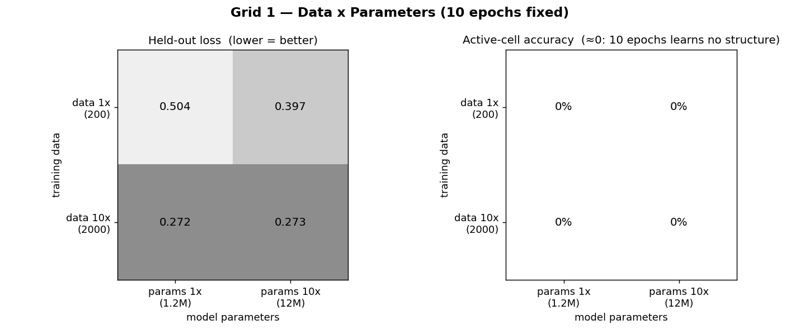
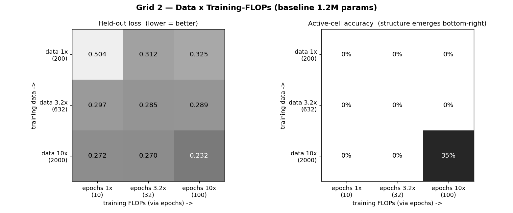
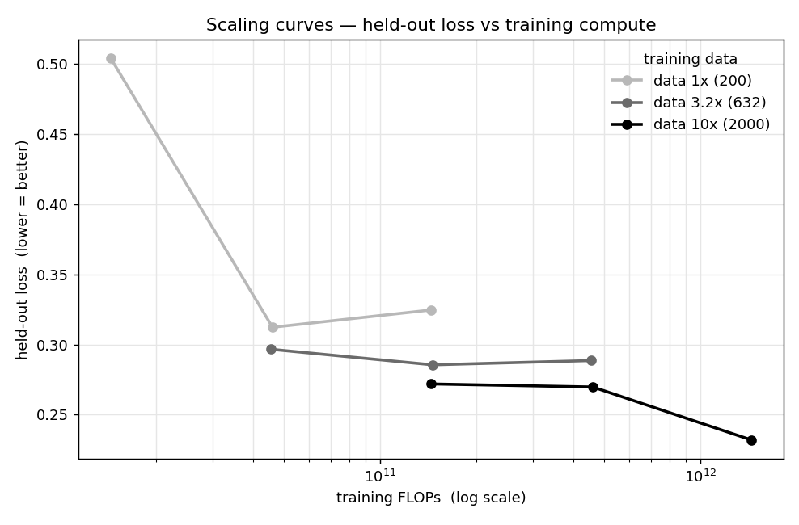

# Snake World Model — Scaling Experiment Log

_Generated 2026-06-11 • CPU-only (4 threads), in-repo PyTorch._

## What this is

A small scaling-laws study on the tiny Snake world model (a 10x10 grid next-frame
predictor). The deployed baseline was trained on **just 200 transitions**
with a **1,200,528-parameter** MLP — i.e. heavily over-parameterized — so there is
lots of headroom to see how each scaling knob moves quality.

Two grids are reported:

* **Grid 1 (2x2): data x parameters**, at a fixed training length (10 epochs).
  Isolates the classic "more data vs. bigger model" question.
* **Grid 2 (3x3): data x training-length (epochs)**, at the baseline model size.
  Brings in the third scaling knob — **training compute / FLOPs** — that the 2x2
  holds fixed. The epochs axis is literally "**10x the FLOPs used to train**"
  (FLOPs = 6 · params · examples · epochs, so at fixed params/data, 10x epochs = 10x FLOPs).

Together the two grids exercise all three knobs (data, parameters, compute), which
is why this pairing was chosen as the most informative.

## A note on metrics (why not plain accuracy?)

A 10x10 Snake frame is **~95% empty cells**, so naive per-cell accuracy and
whole-frame exact-match are dominated by the trivial "predict empty everywhere"
solution (≈94% cell accuracy for a model that has learned nothing). To actually
separate the runs, the **headline metrics are held-out loss and active-cell
accuracy** (accuracy restricted to the cells that carry the snake body, head and
food). Strict metrics (exact next-frame match, precise head localization) are
reported too, but they stay near the floor across the whole sweep — see the
takeaway.

## Method

* **Model.** Same architecture as the deployed baseline (4 hidden ReLU layers).
  Parameter count is scaled by widening the hidden layers:
  1x = hidden 512 (1,200,528 params), 10x = hidden 1871 (12,014,091 params).
* **Data.** Generated with the project's own `collect.py` (deterministic, de-duplicated
  (obs, action) pairs). Sizes are nested subsets of one 2000-transition pool:
  1x = 200, 3.2x = 632, 10x = 2000.
* **Evaluation.** A single FIXED, held-out set of **4000 transitions**, generated
  with a different seed and de-duplicated against the training pool, is reused for
  every cell so the numbers are directly comparable.
* **Quality metrics.**
  * **Held-out loss** (primary) — mean per-cell cross-entropy on the held-out set
    (lower is better); the canonical scaling-law quantity.
  * **Active-cell accuracy** (primary) — accuracy on the cells that are non-empty
    in the target frame, i.e. does the model place the snake + food correctly.
  * **Head accuracy** — fraction of held-out frames where the single highest-probability
    head cell lands exactly on the true head.
  * **Exact next-frame match** — strict: the entire 100-cell frame is correct.
  * **Dream head-tracking** — feed the model its own predictions for 30 steps from
    24 fixed real openings (same greedy policy drives both) and measure how often
    the dreamed head stays on the real head.
* **Training.** Adam, lr 0.001, batch 512, fixed seed for every cell.

---

## Grid 1 — Data x Parameters (10 epochs)

| cell | params | train data | train FLOPs | held-out loss | active-cell acc | head acc | exact match | dream head-track |
|---|---|---|---|---|---|---|---|---|
| data 1x / params 1x | 1,200,528 | 200 | 1.44e+10 | 0.504 | 0.0% | 1.8% | 0.0% | 1.7% |
| data 1x / params 10x | 12,014,091 | 200 | 1.44e+11 | 0.397 | 0.0% | 0.6% | 0.0% | 1.0% |
| data 10x / params 1x | 1,200,528 | 2000 | 1.44e+11 | 0.272 | 0.0% | 1.9% | 0.0% | 2.3% |
| data 10x / params 10x | 12,014,091 | 2000 | 1.44e+12 | 0.273 | 0.0% | 1.6% | 0.0% | 1.0% |

**Effect of 10x data** (averaged over both param sizes): active-cell acc 0.0% -> 0.0% (+0.0%); loss drop +0.178.
**Effect of 10x params** (averaged over both data sizes): active-cell acc 0.0% -> 0.0% (+0.0%); loss drop +0.053.

> Headline: **more data lowered loss far more than more parameters**
> (data loss-drop +0.178 vs params loss-drop +0.053). At a fixed 10 epochs no
> setting yet crosses into learning structure, so active-cell accuracy stays ~0 until the
> training compute is also raised — that emergence shows up in Grid 2.

---

## Grid 2 — Data x Training-FLOPs / epochs (baseline 1.2M params)

| cell | epochs | train data | train FLOPs | held-out loss | active-cell acc | head acc | exact match | dream head-track |
|---|---|---|---|---|---|---|---|---|
| data 1x / epochs 1x | 10 | 200 | 1.44e+10 | 0.504 | 0.0% | 1.8% | 0.0% | 1.7% |
| data 1x / epochs 3.2x | 32 | 200 | 4.61e+10 | 0.312 | 0.0% | 1.9% | 0.0% | 2.3% |
| data 1x / epochs 10x | 100 | 200 | 1.44e+11 | 0.325 | 0.0% | 0.6% | 0.0% | 1.0% |
| data 3.2x / epochs 1x | 10 | 632 | 4.55e+10 | 0.297 | 0.0% | 1.9% | 0.0% | 2.3% |
| data 3.2x / epochs 3.2x | 32 | 632 | 1.46e+11 | 0.285 | 0.0% | 1.9% | 0.0% | 2.3% |
| data 3.2x / epochs 10x | 100 | 632 | 4.55e+11 | 0.289 | 0.0% | 2.3% | 0.0% | 1.4% |
| data 10x / epochs 1x | 10 | 2000 | 1.44e+11 | 0.272 | 0.0% | 1.9% | 0.0% | 2.3% |
| data 10x / epochs 3.2x | 32 | 2000 | 4.61e+11 | 0.270 | 0.0% | 1.9% | 0.0% | 2.3% |
| data 10x / epochs 10x | 100 | 2000 | 1.44e+12 | 0.232 | 35.4% | 2.2% | 0.0% | 1.2% |

**Effect of 10x training FLOPs** (10x epochs, averaged over data): active-cell acc 0.0% -> 11.8% (+11.8%); loss drop +0.076.
**Effect of 10x data** (averaged over epochs): active-cell acc 0.0% -> 11.8% (+11.8%); loss drop +0.122.

> Headline: **spending the extra FLOPs on data beat spending them on longer training**
> (data loss-drop +0.122 vs epochs/FLOPs loss-drop +0.076). Active-cell structure
> only emerges in the bottom-right corner — 10x data **and** 10x epochs together.

---

## Scaling curves

Held-out loss vs training FLOPs, one line per dataset size (from Grid 2). Two things to read
off it: (1) **more data shifts the whole curve down** — a persistent gap that spending more
compute on a smaller dataset never closes; and (2) along each line the **returns to extra
training compute flatten out** — and on the smallest (200-example) dataset the loss even
*rises* again by 100 epochs, the signature of overfitting. That is the classic
data-vs-compute scaling picture in miniature.

---

## Takeaway

The baseline sits in a strongly **data-limited** regime. Both extra data and extra
training compute lower the held-out loss and raise active-cell accuracy, and
data is the bigger lever of the two; adding parameters to the same
tiny dataset does the least.

But the **strict** view is sobering: across the entire sweep the best run still only
reaches **35% active-cell accuracy**, **2% head accuracy**, and **0% exact
next-frame match** — exact-match and precise head-localization stay near the floor
everywhere. With only a few hundred optimizer steps (batch 512 ≥ dataset size),
this recipe under-fits precise localization: scaling data/compute teaches the model
the coarse "where the body roughly is" structure but not the exact one-cell head/food
dynamics, and multi-step dreaming therefore diverges almost immediately. The honest
conclusion: within this regime, **spend a fixed budget on more data first**, but
closing the gap to a faithful world model needs a different recipe (far more
optimizer steps and/or a spatially-aware architecture), not just 10x of any one knob.
