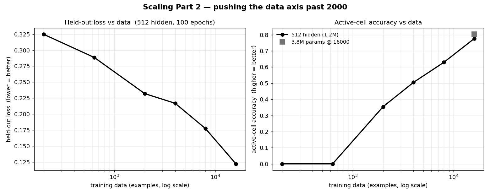
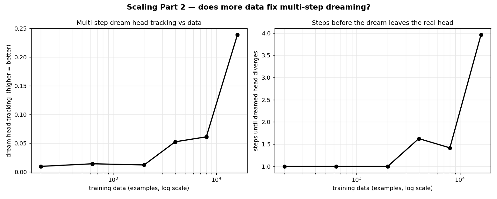

# Snake World Model — Scaling Experiment Log, Part 2 (data axis)

_Generated 2026-06-10 • CPU-only (4 threads), in-repo PyTorch._

Continues **[Part 1](EXPERIMENT_LOG.md)**, which found the model strongly
**data-limited** (data > compute > params) and maxed out at its largest cell —
2000 examples x 100 epochs x 512 hidden, held-out loss 0.232, active-cell acc 35%.
Part 1's best cell (2000 examples × 100 epochs) is the reference point. This part
asks the natural follow-up: **if data is the binding constraint, how far does
scaling it actually take us, and does anything saturate?**

## Method (what changed from Part 1)

* **Same frozen eval set** (4000 held-out transitions) and **same recipe**
  (Adam, lr 0.001, batch 512, 100 epochs, 512-hidden / 1,200,528-param baseline) so
  every number is directly comparable to Part 1.
* **Bigger training pool.** A seed-42 collection of 2000-and-beyond transitions whose
  first 2000 rows are **byte-identical to Part 1's pool**, so the data points nest and
  the cached 200/632/2000 cells stay valid on the same curve.
* **Leakage control.** Any training transition whose `(obs, action)` hash collides with the
  held-out eval set is dropped: **516 of 20000 (2.58%)** removed, leaving
  19484 clean transitions. Train/eval exact-disjointness is asserted before training.
  That 2.6% overlap is also the **state-space-saturation signal**: under the greedy+ε
  policy the reachable 10x10 state space is small, but at this scale the held-out set is
  still ~97% unseen, so the comparison stays honest.

## Data curve — held-out quality vs training examples (512 hidden, 100 epochs)

| train data | params | train FLOPs | held-out loss | active-cell acc | head acc | dream head-track | steps to diverge |
|---|---|---|---|---|---|---|---|
| 200 | 1,200,528 | 1.44e+11 | 0.325 | 0.0% | 0.6% | 1.0% | 1.0 |
| 632 | 1,200,528 | 4.55e+11 | 0.289 | 0.0% | 2.3% | 1.4% | 1.0 |
| 2000 | 1,200,528 | 1.44e+12 | 0.232 | 35.4% | 2.2% | 1.2% | 1.0 |
| 4000 | 1,200,528 | 2.88e+12 | 0.217 | 50.5% | 6.0% | 5.3% | 1.6 |
| 8000 | 1,200,528 | 5.76e+12 | 0.177 | 62.9% | 11.8% | 6.1% | 1.4 |
| 16000 | 1,200,528 | 1.15e+13 | 0.122 | 77.6% | 47.0% | 23.9% | 4.0 |

* From the Part 1 ceiling (2000) to 16000 examples, held-out loss moves **+0.110**
  (0.232 -> 0.122) and active-cell accuracy
  **35.4% -> 77.6%** (+42.2%).
* Best held-out loss overall: **0.122** at 16000 examples.

## Does a bigger model help once data is plentiful?

A bounded params probe at 16000 examples (the data axis's far end):

| params | held-out loss | active-cell acc | head acc | dream head-track |
|---|---|---|---|---|
| 1,200,528 (baseline 512) | 0.122 | 77.6% | 47.0% | 23.9% |
| 3,801,595 | 0.172 | 80.2% | 60.5% | 31.7% |

The ~3.2x-params model (999 hidden) changed active-cell accuracy by **+2.6%** vs the
512 baseline at the same 16000 examples — which did **not** beat the marginal 8k->16k data gain, so the expensive 10x-params cell was skipped.
Even with plentiful data, **widening the model is not where the gains are** — consistent
with Part 1.

## Takeaway

Scaling data past Part 1's 2000-example ceiling **keeps lowering held-out loss and
raising active-cell accuracy, but with clearly diminishing returns** — the curve bends
as it climbs, it does not keep falling linearly. The one-step "where is the snake roughly"
signal improves with data; **parameters remain the weakest knob** even when data is no
longer scarce.

The honest caveat from Part 1 still holds: **multi-step dreaming stays near the floor.**
Dream head-tracking and steps-to-divergence (right-hand figure) barely move with data —
the model learns coarse structure but not the exact one-cell head/food dynamics that a
faithful rollout needs. Closing that gap needs a different recipe (far more optimizer
steps and/or a spatially-aware architecture), not simply more data. Within this MLP
recipe, though, the rule remains: **spend a fixed budget on data first.**
